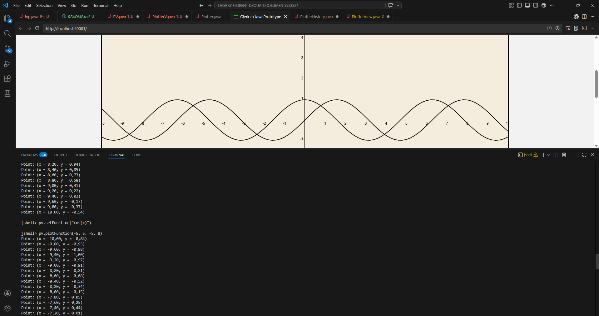
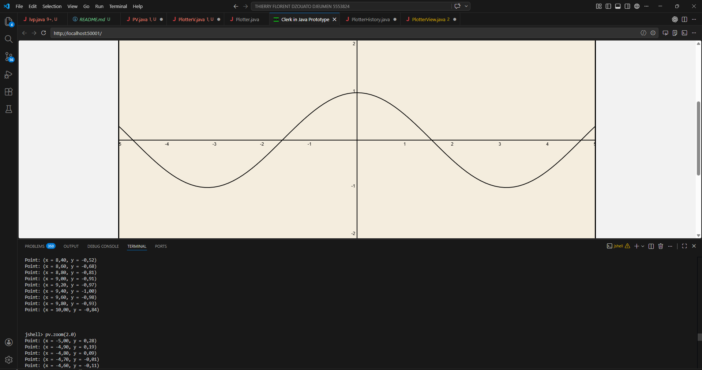
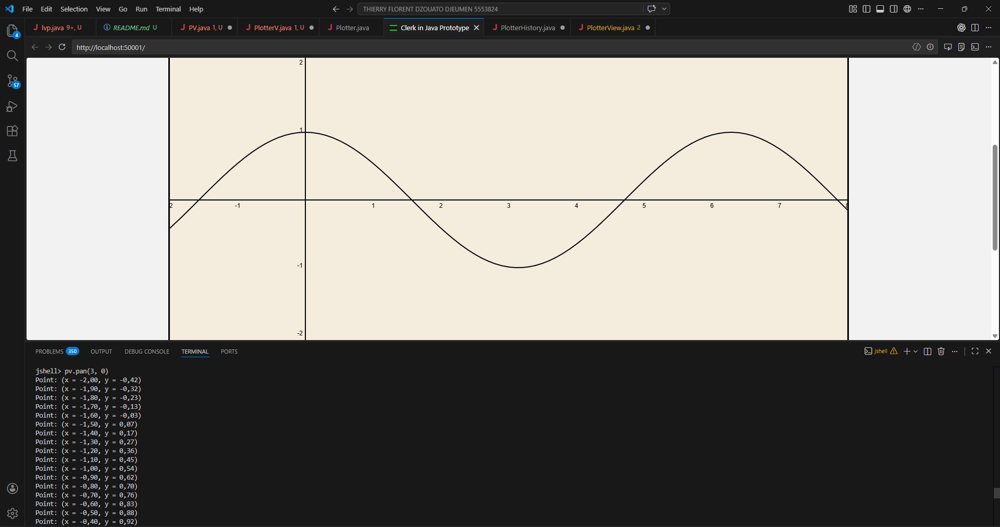
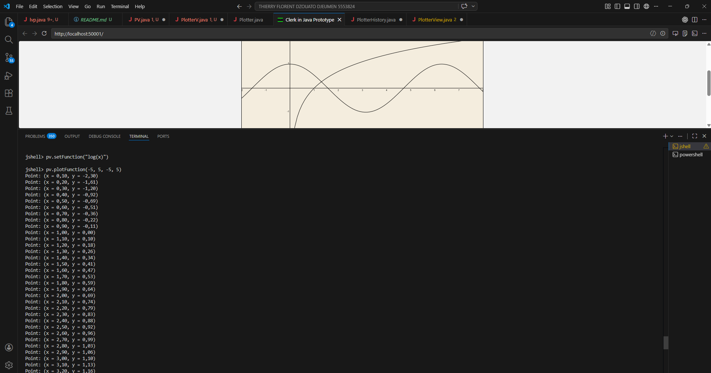

# Funktionsplotter

**Interaktiver mathematischer Funktionsplotter mit Zoom, Pan und Mehrfachdarstellung**

Ein eigenständig entwickeltes Tool zur Visualisierung und Exploration mathematischer Funktionen — speziell konzipiert, um Schülern und Studierenden den Umgang mit Funktionsgraphen zu erleichtern.

  

### Author: Thierry Florent DZOUATO DJEUMEN

##  Features

- **Live-Plotting** mathematischer Funktionen
- **Mehrere Funktionen** gleichzeitig darstellen
- **Interaktive Navigation**: Zoom und Pan
  

- **Anpassbarer Darstellungsbereich**
- **Punkthistorie** mit detaillierter Protokollierung

- **Echtzeit-Visualisierung** über Canvas

---

## 🚀 Schnellstart

### Voraussetzungen
- Java 21 oder höher
- Clerk Framework (LiveView)

### Beispielnutzung (JShell)

```java
Erstmal die Dateien Plotter.java, PlotterView.java und PlotterHistory.java öffnen.
Danach Clerk.view()

PlotterView pv = new PlotterView();

// Funktion plotten
pv.setFunction("sin(x)");
pv.plotFunction();

// Mit eigenem Koordinatenbereich
pv.setFunction("log(x)");
pv.plotFunction(-8, 8, -10, 20);

// Interaktion
pv.zoom(2.0);        // Hineinzoomen
pv.pan(3, 0);        // Verschieben